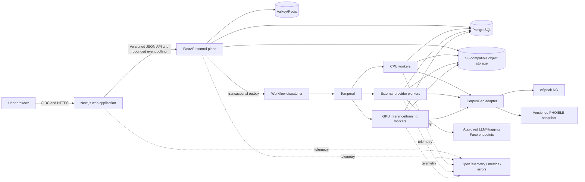

# CorpusKit architecture

## Purpose and scope

CorpusKit is a multi-user web workbench for designing reproducible speech corpora. It
exposes CorpusGen's inventory, G2P, evaluation, optimization, generation, guidance, and
training capabilities as durable workflows for real users. CorpusKit owns product concerns
such as identity, tenancy, versioning, persistence, job orchestration, quotas, auditability,
and observability. CorpusGen remains the linguistic computation engine.

This document describes the target production architecture. An implemented capability is
not production-ready until it also has an acceptance test, user documentation, operational
telemetry, and a runbook for its expected failure modes.

## Design principles

1. **Reproducible by default.** Inputs, parameters, engine/data/model versions, seeds, and
   output hashes are recorded for every run.
2. **Immutable scientific history.** Source data and past results are never silently
   rewritten. Corrections create new versions.
3. **Durable asynchronous compute.** Expensive or externally dependent operations run as
   cancellable, observable jobs rather than HTTP requests.
4. **One linguistic boundary.** Only the CorpusGen adapter package imports `corpusgen`.
5. **Least privilege and tenant isolation.** Authorization is enforced in the API and
   reinforced in storage and worker execution.
6. **Honest degradation.** Missing GPU, provider, model, or data capabilities are reported
   explicitly; fixture output is never presented as live computation.
7. **Progressive complexity.** Presets make the common workflows approachable while an
   expert configuration exposes every supported CorpusGen control.

## System context



The browser never connects directly to Temporal, the database, object storage, eSpeak,
models, or external providers. All authorization and resource ownership checks occur in the
API. Workers receive stable resource identifiers and secret references, not browser tokens
or plaintext provider credentials.

## Runtime components

### Web application

The Next.js application provides onboarding, corpus import, the Inventory and G2P
explorers, analysis dashboards, optimization and generation studios, run monitoring,
comparison, and export. Hand-written strict TypeScript parsers validate every response from the
versioned JSON API. A committed canonical OpenAPI snapshot is checked for drift and conservative
backward compatibility, but it is not currently used to generate the browser clients. The browser
polls bounded run-event and progress projections; SSE and TanStack Query are not dependencies in
this release. Visualization components remain keyboard accessible and expose equivalent tabular
data.

The web tier is not trusted to authorize actions. It may hide unavailable controls for user
experience, but the API independently validates every request and resource reference.

### API control plane

FastAPI is responsible for:

- OIDC token validation and organization membership checks;
- project, corpus, version, run, artifact, and model metadata;
- validation and normalization of immutable run specifications;
- transactional quotas, per-run cost ceilings, and capability availability;
- job creation through a transactional outbox;
- run status, result projections, audit events, and signed artifact downloads;
- cancellation and retry requests;
- a bounded monotonic run-event polling endpoint; and
- a development/test OpenAPI document (the production HTTP route is disabled).

The API does not execute CorpusGen operations inline except tightly bounded read-only
lookups demonstrated to remain below the synchronous latency budget. Corpus evaluation,
selection, generation, model inference, training, imports, and exports are jobs.

### CorpusGen adapter

`src/corpuskit/adapters/corpusgen/` is the sole integration boundary. It maps versioned
CorpusKit request models to CorpusGen calls and maps CorpusGen dataclasses to stable,
JSON-safe result models. It must not leak CorpusGen objects across the boundary. The adapter
also classifies failures into validation, dependency, transient provider, resource,
cancellation, and internal error categories.

CorpusGen is exact-pinned. An upgrade requires golden compatibility tests for all supported
capabilities and a deliberate schema or result migration when behavior changes. CorpusKit
calls Python APIs rather than shelling out to the CorpusGen CLI; the UI can generate
equivalent CLI and Python recipes for reproduction.

See [ADR-0001](../adr/0001-corpusgen-adapter-boundary.md).

### Temporal workflows and workers

Temporal owns durable execution, retries, heartbeats, cancellation, and recovery from
process restarts. PostgreSQL remains the product-facing source of job summaries and events.
A transactional outbox avoids a database/workflow dual-write race. The dispatcher starts a
workflow with an idempotent name derived from the job ID.

Task queues isolate different dependency and trust profiles:

- `interactive-cpu`: G2P, inventory, bounded analysis, and small selection;
- `batch-cpu`: large analysis, optimization, and bounded DATG index construction;
- `external-provider`: hosted LLM calls and allowlisted Hugging Face repository import/generation;
- `gpu-inference`: local generation, perplexity, and Phon-DATG; and
- `gpu-training`: Phon-RL training and checkpoint publication.

The authenticated `POST /api/v1/runs` endpoint is the generic durable-submission route. Advanced
operation-specific HTTP routes validate or estimate only; they never execute provider or model work
inside the API process. The reserved internal `export` run kind is deliberately absent from the
submission request enum until a bounded durable export handler exists, so it cannot be queued into a
worker that can only fail with an unregistered-handler error.

Retry policies apply only to explicitly classified transient failures. Validation,
unsupported-language, incompatible-model, quota, and exhausted-budget errors are terminal.
Activities commit outputs idempotently. Generation progress callbacks become activity
heartbeats; long training activities checkpoint before cooperative cancellation where the
underlying model supports it.

Artifact-producing children have no tenant authority. They may stage bounded strict result JSON at a
SHA-256 address and return only its digest, size, media type, result type, and reviewed schema. The
parent reloads tenant/project/run/creator facts, validates and adopts the bytes, and commits the
artifact row with the terminal run event in one database transaction. A server-capped deadline
derived from the authoritative request DTO controls the existing outer child process; no nested
process or child-supplied timeout is trusted.

See [ADR-0003](../adr/0003-temporal-job-orchestration.md) and
[ADR-0006](../adr/0006-worker-profile-separation.md).

## Product information architecture

Top-level navigation is organized around user goals:

- **Home**: explicitly illustrative guided orientation with links to the live project,
  evaluation, inventory, selection, generation, and capability workbenches;
- **Projects**: the tenant boundary for related corpora, runs, and members;
- **Corpora**: import, normalize, inspect, and version sentence collections;
- **Inventory**: PHOIBLE/eSpeak mapping, segment classes, marginal segments,
  allophones, and distinctive-feature filtering;
- **Analyze**: coverage, distribution, text quality, coverage trajectory, error rates,
  and perplexity;
- **Optimize**: all six selection algorithms, budgets, targets, and weighting modes;
- **Generate**: repository, Hugging Face, hosted LLM, and local model backends with
  scoring, readability filters, Phon-DATG, and saved Phon-RL adapters;
- **Advanced**: redacted runtime gates, no-I/O validation/estimates, bounded DATG/Phon-RL
  laboratories, durable advanced job submission, and non-executing CLI previews;
- **Compare**: corpus and run deltas, including coverage saturation and quality metrics;
- **Runs**: live state, progress, warnings, costs, lineage, retry, cancellation, and logs
  safe for end-user display;
- **Exports**: corpus files, JSON/JSON-LD reports, manifests, and reproducibility recipes;
  and
- **Settings**: membership, retention, provider secrets, quotas, and audit history.

Every advanced option is represented in the run specification even when a preset supplied
its value. A run detail page is the canonical explanation of what was executed and why it
stopped.

## Capability-to-compute mapping

| Surface               | CorpusGen integration                                                 | Default worker                  |
| --------------------- | --------------------------------------------------------------------- | ------------------------------- |
| Inventory and G2P     | PHOIBLE lookup/mapping/features; single/batch G2P                     | interactive CPU                 |
| Coverage analysis     | phoneme, diphone, triphone; custom/derived/PHOIBLE target; provenance | CPU                             |
| Quality analysis      | entropy, JSD, correlation, CV, PCD, text quality                      | CPU                             |
| Trajectory            | sentence-level marginal gain and saturation curve                     | CPU                             |
| Error analysis        | WER, CER, PER, SER and sentence details                               | CPU                             |
| Perplexity            | corpus and sentence-level causal-LM perplexity                        | GPU inference or opted-in CPU   |
| Selection             | greedy, CELF, stochastic, ILP, distribution, NSGA-II; all weights     | CPU                             |
| Repository generation | text/pre-phonemized/Hugging Face pools                                | external provider               |
| Hosted generation     | LLM API backend and composite scoring                                 | external provider               |
| Local generation      | local model, quantization, composite scoring                          | GPU inference                   |
| Guidance              | none, Phon-DATG, saved Phon-RL policy                                 | GPU inference                   |
| Training              | PPO/Phon-RL, reward details, checkpoints, adapter publication         | GPU training                    |
| Export                | text, JSON, JSON-LD-EX, JSONL/Parquet and manifest                    | synchronous API; no run handler |

## Persistence and lineage

PostgreSQL stores organizations, users, memberships, projects, corpus/version metadata,
bounded sentence indexes, inventory snapshots, immutable run specifications, jobs, job
events, result summaries, artifact metadata, provider secret references, models/adapters,
and audit events. Every tenant-owned row includes `organization_id`; row-level security is
a second layer behind API authorization. PostgreSQL forces RLS on every current tenant table.
Each transaction receives a validated organization/user or narrowly scoped service identity,
and policies also require the matching non-owner database policy role. Dispatcher is global
only for outbox select/update; maintenance discovers bounded candidates globally and performs
mutations under their authoritative organization. Bounded object scans persist opaque
continuations in a forced-RLS maintenance-only table keyed by a non-secret backend fingerprint;
storage cursors never cross the operator-output boundary. SQLite local demos retain explicit
application predicates but have no RLS and are rejected by staging/production configuration.

One locked usage row and unique reservation per run serialize tenant quota admission. The
reservation lease follows the validated run deadline plus termination grace; terminal state
releases it idempotently, while stale maintenance first terminalizes a run before releasing
capacity. Artifact/corpus counters commit with metadata. Security-relevant mutations append a
small allowlisted event to a per-tenant sequence/hash chain in the same transaction, and
PostgreSQL rejects audit-event update/delete. The chain is tamper-evident, not externally
anchored or WORM storage.

Object storage contains original uploads, normalized immutable corpus snapshots, detailed
JSONL/Parquet outputs, exports, and model adapters. Artifacts are addressed by SHA-256 and
associated with an organization, project, and optional producing run. Authenticated full-object
downloads verify SHA-256 and size while streaming; S3 deployments may alternatively issue a
short-lived fixed-endpoint SigV4 URL after an authorization check. Public artifact creation is
restricted to untrusted corpus text. A non-HTTP parent-only path can adopt strict staged run
results under facts reloaded from the durable run. A second parent-only service records immutable
worker facts, constructs a canonical run-owned manifest after success, and submits a new durable
run from a verified source manifest. Trusted exports and production worker-fact composition remain
closed until each handler's provenance policy is complete. Manifest publication is
adoption-role-only; the mounted replay router can submit/read lineage but cannot create facts or
manifests.

A run records at least:

- CorpusKit and CorpusGen versions;
- normalized parameters and random seeds;
- input corpus-version and artifact hashes;
- PHOIBLE revision/checksum and eSpeak version when used;
- provider/model ID and immutable revision when used;
- worker image/profile/policy identity plus dependency attestations;
- timestamps, stop reason, warnings, and resource/cost measurements; and
- output hashes and lineage to newly created corpus versions.

See [ADR-0002](../adr/0002-immutable-corpus-and-run-versions.md),
[ADR-0005](../adr/0005-storage-and-multi-tenancy.md), and
[ADR-0007](../adr/0007-tenant-context-quota-audit.md). The operational trust boundary and replay
classification contract are documented in
[reproducibility manifests and durable replay](../operations/reproducibility-manifests-replay.md).

## Job lifecycle

The externally visible state machine is:

```text
draft -> queued -> provisioning -> running -> succeeded
                                   |       |
                                   |       +-> failed
                                   +-> cancelling -> cancelled
```

The database stores the current projection plus an append-only event sequence. Events have
monotonic sequence numbers and the client polls forward from the last observed sequence.
Cancellation is a request, not an immediate promise: the state becomes `cancelling` until the
worker has stopped safely. A retry creates a new attempt linked to the original run; it does not
erase the prior failure. SSE is a possible later transport optimization, not a current public
contract.

## Identity and secrets

Production identity uses OIDC Authorization Code flow with PKCE. The web tier uses an opaque
secure, HTTP-only, same-site `__Host-` cookie; access, refresh, and ID tokens remain in
application-encrypted Redis/Valkey records and are never browser-visible. The BFF resolves and
refreshes the server session under a distributed per-session lock, validates session-bound CSRF
on mutations, discards browser authorization, and synthesizes the API bearer header. Organization
roles are `owner`, `admin`, `editor`, and `viewer`. All access checks use the authenticated
subject and organization membership; tenant identity is never accepted from an unverified
request field alone.

Provider keys are either session-only or stored in a cloud secret manager under envelope
encryption. Database records and workflow histories contain only opaque secret references.
Credentials, authorization headers, prompts, corpus text, and generated text are excluded
from logs by default.

See [ADR-0004](../adr/0004-external-oidc-and-secret-references.md) and the
[threat model](../threat-model/README.md).

## Observability and service objectives

The production target requires correlated OpenTelemetry traces, structured logs, and metrics
keyed by request, job, workflow, and organization identifiers. The repository does not yet
claim that complete production observability or alerting is implemented. High-cardinality
text, phonemes, prompts, and secrets must not become metric labels. Required signals include HTTP
latency/error rate, outbox lag, Temporal queue lag, workflow/activity failures, retries,
heartbeats, cancellation latency, worker saturation, GPU utilization/memory, provider
latency/cost, object-store failures, and database pool/transaction health.

The implemented first layer is intentionally narrower: operator-authenticated,
low-cardinality API HTTP metrics plus structured access logging with hashed request correlation
and recursive credential/content redaction. Its deployment and security contract, along with
the remaining signal gaps, is documented in
[`../operations/observability.md`](../operations/observability.md).

Initial production objectives are:

- 99.9% monthly API availability, excluding the success of third-party providers;
- non-job API p95 below 300 ms at the documented reference load;
- progress visible within two seconds of a committed worker update;
- no duplicate committed result for an idempotency key; and
- recovery from API or worker restart without losing a queued/running job.

Alerts must link to versioned runbooks. Restore drills validate the declared recovery point
and recovery time objectives before general availability.

## Deployment modes

### Local demo

Docker Compose supplies the web app, API, PostgreSQL, S3-compatible storage, Temporal, and a
CPU worker with pinned PHOIBLE data and a sample corpus. The core import, inventory, G2P,
analysis, selection, repository generation, comparison, and export journey works without
an external account or provider key. A GPU profile adds local generation, perplexity,
Phon-DATG, and Phon-RL. Recorded walkthrough fixtures, if present, are visibly labeled and
cannot be mistaken for provider/model execution.

### Production

Kubernetes runs stateless web and API deployments plus independently autoscaled worker
pools. GPU nodes are isolated by taints, tolerations, runtime class, and network policy.
Managed PostgreSQL, object storage, Temporal, and secrets management are preferred. Helm
defines application resources; Terraform defines cloud resources. Releases promote the
same signed images through development, staging, and production. Schema migrations run as
a release job before compatible application rollout.

## Repository boundaries

```text
apps/web/                         web product
src/corpuskit/api/                HTTP control plane
src/corpuskit/adapters/corpusgen/ only CorpusGen imports
src/corpuskit/domain/             pure product rules and state transitions
src/corpuskit/services/           application use cases
src/corpuskit/workflows/          Temporal workflows and activities
src/corpuskit/persistence/        database and object-store adapters
src/corpuskit/security/           identity, authorization, secrets, audit
src/corpuskit/telemetry/          logs, traces, metrics, redaction
tests/                            unit/property/integration/contract/E2E/acceptance
infra/                            Compose, Helm, and Terraform
docs/                             architecture, ADRs, threat model, runbooks, product docs
```

Domain code does not depend on FastAPI, SQLAlchemy, Temporal, object-store SDKs, or
CorpusGen. Dependency direction points from delivery/infrastructure adapters toward domain
interfaces.

## Required architecture tests

- No package outside `src/corpuskit/adapters/corpusgen/` imports `corpusgen`.
- Web code accesses backend behavior only through the generated API client.
- Tenant-owned repositories require an organization scope and exercise PostgreSQL RLS.
- Workflow inputs contain IDs and secret references, never raw provider credentials.
- Run specifications and corpus versions reject in-place mutation.
- Worker images contain only dependencies required by their declared profile.
- External-provider and GPU-training workers cannot read another organization's artifacts.
- Golden fixtures compare adapter results with direct calls to the pinned CorpusGen version.

## Related decisions

- [ADR-0001: CorpusGen adapter boundary](../adr/0001-corpusgen-adapter-boundary.md)
- [ADR-0002: Immutable corpus and run versions](../adr/0002-immutable-corpus-and-run-versions.md)
- [ADR-0003: Temporal job orchestration](../adr/0003-temporal-job-orchestration.md)
- [ADR-0004: External OIDC and secret references](../adr/0004-external-oidc-and-secret-references.md)
- [ADR-0005: Storage and multi-tenancy](../adr/0005-storage-and-multi-tenancy.md)
- [ADR-0006: Worker profile separation](../adr/0006-worker-profile-separation.md)
- [ADR-0007: Tenant context, quotas, and audit evidence](../adr/0007-tenant-context-quota-audit.md)
